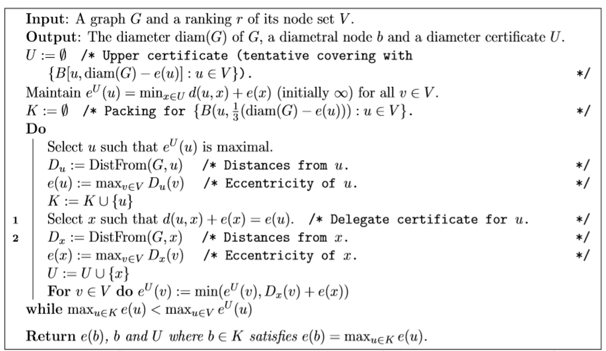
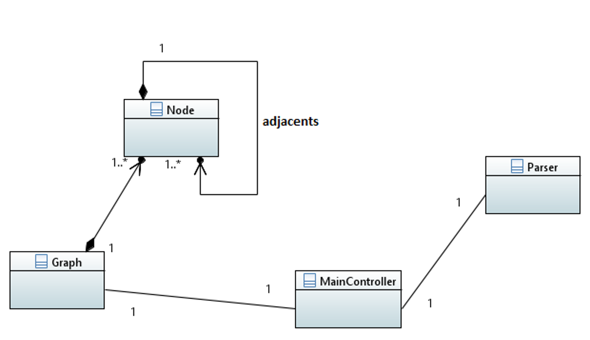

# diameter-computation

- This is an Java-based implementation of the paper [1] which is briefly about a new efficient attempt to compute the diameter of a graph.

## Algorithm.

## Implementation

## References
[1] : [F.Dragany M.Habibz L.Viennot, "Revisiting Radius, Diameter, and all Eccentricity Computation in Graphs through Certificates", 2018]
